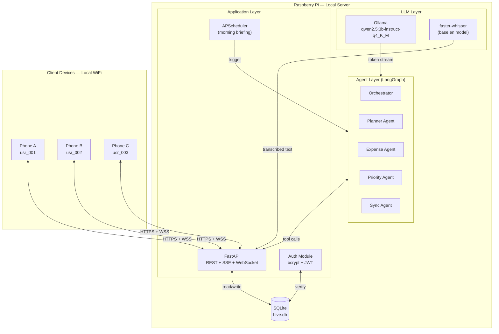
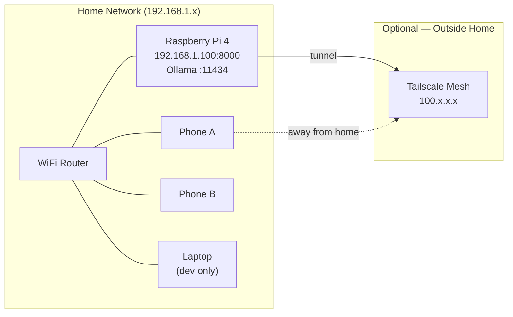
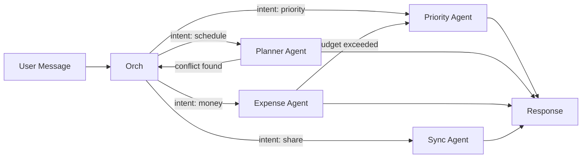
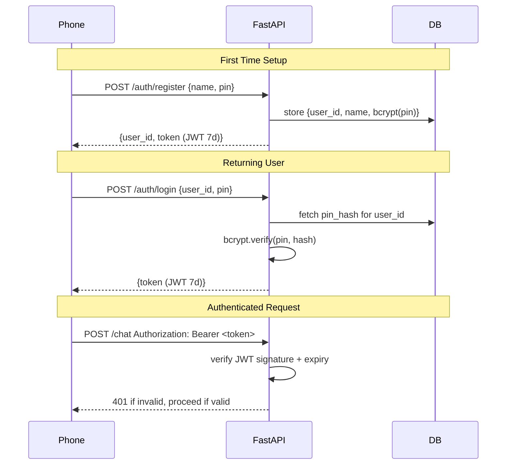
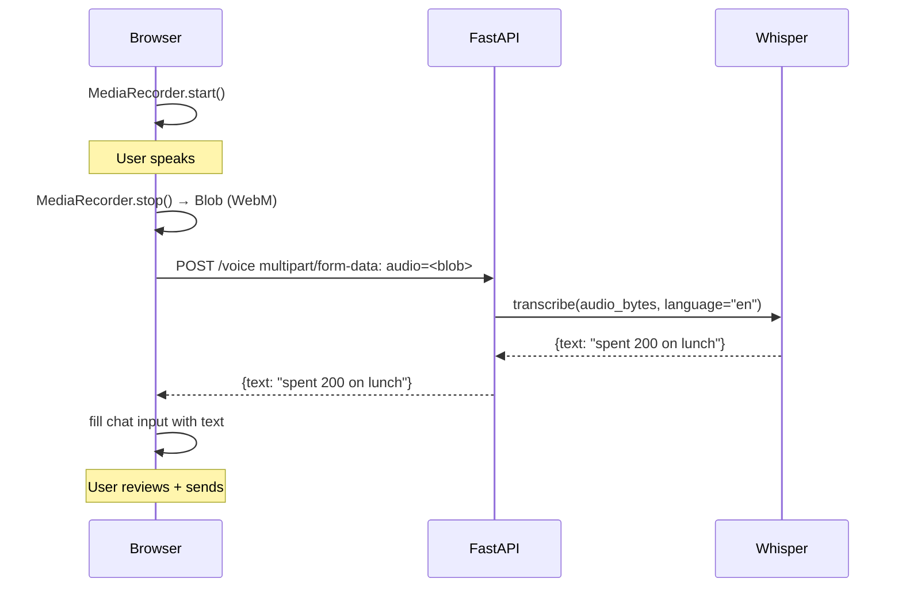
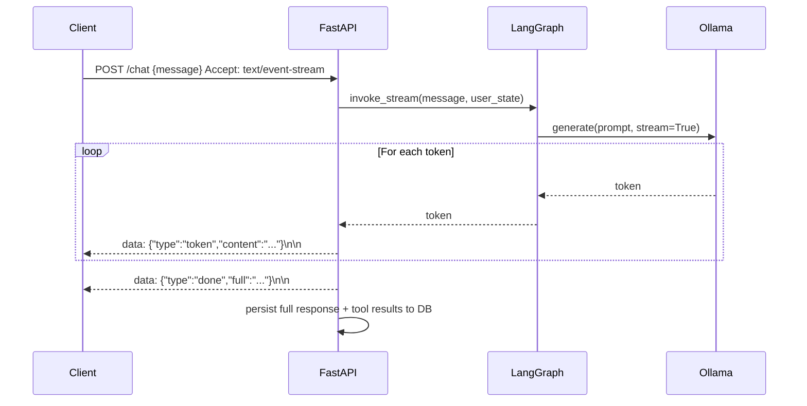
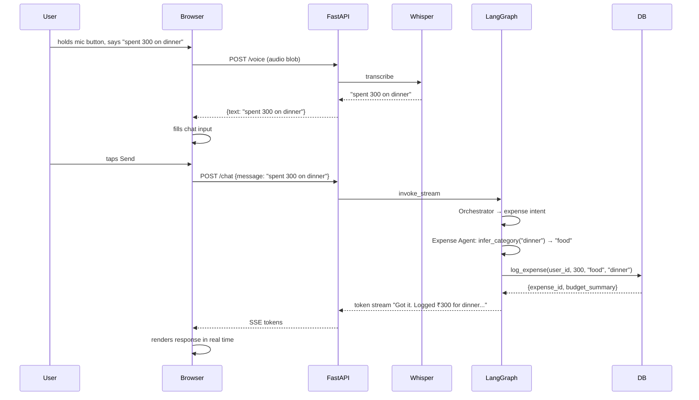
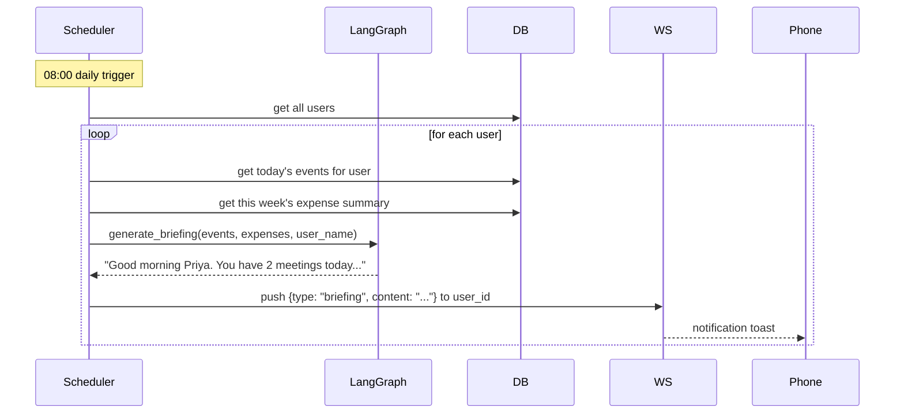
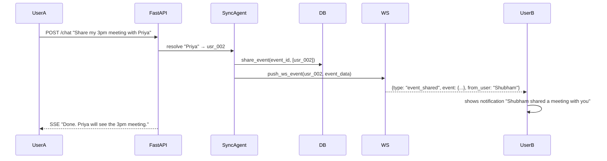

# Hive — Design Document
**Version:** 1.0 | **Status:** Draft | **Scope:** Tier 1 MVP

---

## Table of Contents
1. [Overview](#1-overview)
2. [System Architecture](#2-system-architecture)
3. [Tech Stack](#3-tech-stack)
4. [Component Design](#4-component-design)
   - 4.1 LLM Layer
   - 4.2 Agent Layer
   - 4.3 Auth Layer
   - 4.4 Voice Layer
   - 4.5 Streaming Layer
   - 4.6 Scheduler Layer
5. [Database Schema](#5-database-schema)
6. [API Contract](#6-api-contract)
7. [Agent Design](#7-agent-design)
8. [Data Flows](#8-data-flows)
9. [Frontend Design](#9-frontend-design)
10. [Build Plan](#10-build-plan)
11. [Open Questions](#11-open-questions)

---

## 1. Overview

**Hive** is a locally-hosted, multi-user AI life assistant. It runs on a Raspberry Pi, serves connected phones on the same WiFi, and uses open-weight LLMs for all intelligence — no cloud, no API keys, no subscriptions.

### Goals for MVP

| Goal | Measure |
|---|---|
| AI responds in under 8 seconds on Pi 4 | Token streaming starts within 2s |
| All four Tier 1 features ship | Checklist in §10 |
| Two phones sync a shared event live | Demo-able in < 30 seconds |
| No user data leaves the local network | Zero outbound API calls during core use |

### What Hive Does (Tier 1 scope)

- **Chat with AI** — natural language to plan, log expenses, ask for priorities
- **Planner** — create, view, share, and conflict-check events
- **Expense tracker** — log spend, categorize, view budget summary
- **Priority ranking** — "what should I do today?" returns a scored list
- **Voice input** — speak instead of type, Whisper transcribes locally
- **Morning briefing** — proactive daily summary pushed at 8am via WebSocket
- **PIN auth** — 4-digit PIN per user, bcrypt-hashed, JWT sessions
- **Streaming responses** — tokens stream to client as model generates

---

## 2. System Architecture

### High-Level Components



### Network Layout



---

## 3. Tech Stack

| Layer | Technology | Version | Notes |
|---|---|---|---|
| LLM Runtime | Ollama | latest | Manages model lifecycle |
| LLM Model | qwen2.5:3b-instruct-q4_K_M | 3B Q4 | ~2GB RAM, ~4-6s/response on Pi 4 |
| Fallback Model | qwen2.5:1.5b-instruct-q4_K_M | 1.5B Q4 | ~1.1GB, ~2-3s — for Pi 3 / low RAM |
| STT | faster-whisper | 1.x | base.en model, ~150MB, runs on Pi CPU |
| Agent Framework | LangGraph | 0.2.x | Stateful cyclic graphs |
| LLM SDK | langchain-ollama | latest | Ollama ↔ LangChain bridge |
| Backend | FastAPI | 0.115.x | Async, SSE, WebSocket native |
| Scheduler | APScheduler | 3.x | Morning briefing cron |
| Auth | python-jose + bcrypt | latest | JWT tokens + PIN hashing |
| Database | SQLite (aiosqlite) | latest | Single file, zero config |
| Frontend | React 19 + Vite | latest | PWA manifest included |
| Styling | Tailwind CSS | 3.x | Utility-first, mobile-first |
| Remote access | Tailscale | latest | Optional, zero-config VPN |

### Model Benchmarks (Raspberry Pi 4 — 4GB RAM)

| Model | RAM Usage | Time to First Token | Full Response (~100 tokens) |
|---|---|---|---|
| qwen2.5:1.5b-q4_K_M | ~1.1 GB | ~1.5s | ~4s |
| qwen2.5:3b-q4_K_M | ~2.0 GB | ~2.5s | ~7s |
| phi3.5:3.8b-q4_K_M | ~2.4 GB | ~3.0s | ~9s |

**Recommendation:** Start with `qwen2.5:3b-q4_K_M`. If response latency is unacceptable during demo, drop to `1.5b`.

---

## 4. Component Design

### 4.1 LLM Layer

Ollama runs as a background service on the Pi, exposed at `localhost:11434`. LangGraph connects via `langchain-ollama`.

**System prompt** (stored in `modelfile`):
```
You are Hive, a personal AI assistant running locally on a Raspberry Pi.
You help users plan their day, track expenses, and prioritize tasks.
You have access to tools. Always use them — never fabricate data.
Be concise. Respond in plain text, no markdown.
Today's date is {date}. The user's name is {user_name}.
```

### 4.2 Agent Layer

Four specialized agents + one orchestrator, all sharing a LangGraph state graph.



Each agent has **tools** — Python functions that read/write SQLite and push WebSocket events. The orchestrator classifies intent and delegates. If an agent discovers a downstream condition (e.g., expense pushes user over budget), it passes control back to the orchestrator for re-routing.

### 4.3 Auth Layer



- Token is stored in `localStorage` on the client
- WebSocket sends token as query param: `ws://pi/ws/{user_id}?token=...`
- Tokens expire in 7 days; re-login refreshes

### 4.4 Voice Layer



- `faster-whisper` with `base.en` model (~150MB) runs on Pi CPU
- Transcription of a 5-second clip takes ~1-2 seconds on Pi 4
- Client uses browser MediaRecorder API — no native app needed

### 4.5 Streaming Layer

All `/chat` responses stream tokens using **Server-Sent Events (SSE)**.



- Client renders tokens as they arrive — no waiting for full response
- On `done`, client saves the complete message to local state
- Tool call results (e.g., "event created") arrive as `{"type":"tool","name":"create_event","result":{...}}`

### 4.6 Scheduler Layer

APScheduler runs inside FastAPI's lifespan. Two jobs:

| Job | Schedule | Action |
|---|---|---|
| Morning Briefing | Every day 08:00 local time | Generate summary for each user, push via WebSocket |
| Priority Refresh | Every day 06:00 local time | Re-score all open tasks for the day ahead |

**Briefing generation flow:**
1. Fetch today's events for user from DB
2. Fetch this week's expense summary
3. Prompt LLM: "Generate a friendly morning briefing in 2-3 sentences."
4. Push via WebSocket: `{"type": "briefing", "content": "..."}`
5. Client shows it as a toast notification

---

## 5. Database Schema

```sql
-- Users
CREATE TABLE users (
    id          TEXT PRIMARY KEY,          -- e.g. "usr_a3f9"
    name        TEXT NOT NULL,
    pin_hash    TEXT NOT NULL,             -- bcrypt hash of 4-digit PIN
    created_at  TEXT NOT NULL              -- ISO 8601
);

-- Sessions
CREATE TABLE sessions (
    token       TEXT PRIMARY KEY,          -- JWT (stored for revocation)
    user_id     TEXT NOT NULL REFERENCES users(id),
    expires_at  TEXT NOT NULL
);

-- Events
CREATE TABLE events (
    id           TEXT PRIMARY KEY,         -- UUID
    user_id      TEXT NOT NULL REFERENCES users(id),
    title        TEXT NOT NULL,
    start_dt     TEXT NOT NULL,            -- ISO 8601
    end_dt       TEXT NOT NULL,
    description  TEXT,
    shared_with  TEXT,                     -- JSON array of user_ids
    priority     REAL DEFAULT 0.5,         -- 0.0 to 1.0
    created_at   TEXT NOT NULL
);

-- Expenses
CREATE TABLE expenses (
    id           TEXT PRIMARY KEY,
    user_id      TEXT NOT NULL REFERENCES users(id),
    amount       REAL NOT NULL,
    currency     TEXT NOT NULL DEFAULT 'INR',
    category     TEXT NOT NULL,            -- food, transport, utilities, etc.
    description  TEXT,
    date         TEXT NOT NULL,            -- YYYY-MM-DD
    created_at   TEXT NOT NULL
);

-- Priority Queue (refreshed daily)
CREATE TABLE priorities (
    id           TEXT PRIMARY KEY,
    user_id      TEXT NOT NULL REFERENCES users(id),
    ref_id       TEXT NOT NULL,            -- event_id or expense_id
    ref_type     TEXT NOT NULL,            -- 'event' | 'expense' | 'task'
    score        REAL NOT NULL,            -- 0.0 to 1.0 (higher = more urgent)
    reason       TEXT,                     -- why this score
    updated_at   TEXT NOT NULL
);

-- Chat History (per user, last 50 messages kept)
CREATE TABLE messages (
    id           TEXT PRIMARY KEY,
    user_id      TEXT NOT NULL REFERENCES users(id),
    role         TEXT NOT NULL,            -- 'user' | 'assistant'
    content      TEXT NOT NULL,
    created_at   TEXT NOT NULL
);
```

---

## 6. API Contract

### Auth

| Method | Path | Body | Response |
|---|---|---|---|
| POST | `/auth/register` | `{name, pin}` | `{user_id, token}` |
| POST | `/auth/login` | `{user_id, pin}` | `{token}` |

### Chat

| Method | Path | Body | Response |
|---|---|---|---|
| POST | `/chat` | `{message, user_id}` | `text/event-stream` SSE tokens |

### Voice

| Method | Path | Body | Response |
|---|---|---|---|
| POST | `/voice` | `multipart: audio=<blob>` | `{text: "transcribed text"}` |

### Events

| Method | Path | Params | Response |
|---|---|---|---|
| GET | `/events/{user_id}` | `?from=&to=` | `[Event]` |
| POST | `/events` | `{user_id, title, start_dt, end_dt, description?}` | `Event` |
| DELETE | `/events/{event_id}` | — | `{ok: true}` |

### Expenses

| Method | Path | Params | Response |
|---|---|---|---|
| GET | `/expenses/{user_id}` | `?month=YYYY-MM` | `[Expense]` + `{total, by_category}` |
| POST | `/expenses` | `{user_id, amount, category, description?, date}` | `Expense` |

### Priorities

| Method | Path | Response |
|---|---|---|
| GET | `/priorities/{user_id}` | `[Priority]` ranked by score desc |
| POST | `/priorities/refresh/{user_id}` | triggers re-rank, returns `[Priority]` |

### Export

| Method | Path | Response |
|---|---|---|
| GET | `/export/json/{user_id}` | `application/json` dump of all user data |
| GET | `/export/csv/{user_id}` | `text/csv` of expenses |

### WebSocket

```
WS /ws/{user_id}?token=<jwt>
```

**Incoming (client → server):** regular chat messages as JSON `{type: "chat", message: "..."}`

**Outgoing (server → client) message types:**

| type | When sent | Payload |
|---|---|---|
| `token` | During streaming | `{content: "word"}` |
| `done` | Stream complete | `{full: "full response"}` |
| `tool` | Tool executed | `{name: "create_event", result: {...}}` |
| `event_shared` | Another user shared an event | `{event: Event, from_user: "name"}` |
| `briefing` | 8am scheduler | `{content: "Good morning..."}` |
| `error` | Any failure | `{message: "..."}` |

---

## 7. Agent Design

### Orchestrator

Classifies intent using a lightweight prompt (no tool calls), then routes to the correct agent. Falls back to Priority Agent if intent is ambiguous.

**Intents:**
- `schedule` → Planner Agent
- `expense` → Expense Agent
- `priority` → Priority Agent
- `share` → Sync Agent
- `general` → respond directly without sub-agent

### Planner Agent

**Tools:**

| Tool | Signature | Description |
|---|---|---|
| `get_events` | `(user_id, from_dt, to_dt)` | Fetch events in date range |
| `create_event` | `(user_id, title, start_dt, end_dt, desc?)` | Create event, returns conflict warning if any |
| `delete_event` | `(event_id)` | Remove event |
| `check_conflicts` | `(user_id, start_dt, end_dt)` | Returns list of overlapping events |
| `share_event` | `(event_id, target_user_ids[])` | Marks event shared, triggers Sync Agent |

**Conflict handling:** If `check_conflicts` returns results, agent returns to Orchestrator with `{"replan": true, "reason": "conflict"}` rather than creating silently.

### Expense Agent

**Tools:**

| Tool | Signature | Description |
|---|---|---|
| `log_expense` | `(user_id, amount, category, desc?, date?)` | Insert expense, returns updated budget summary |
| `get_expenses` | `(user_id, month)` | Fetch expenses + totals by category |
| `get_budget_summary` | `(user_id, month)` | Total spend, by category, vs prior month |
| `infer_category` | `(description)` | LLM call to classify text into a category |

If `log_expense` results in the user exceeding a soft threshold (> 80% of average monthly spend), the agent signals the Priority Agent to re-rank.

### Priority Agent

Scores all open events and tasks using a weighted formula:

```
score = (0.4 × deadline_urgency) + (0.3 × user_importance) + (0.3 × budget_impact)
```

- `deadline_urgency`: 1.0 if due today, decays over 7 days
- `user_importance`: derived from how often user interacted with this item
- `budget_impact`: 1.0 if expense-linked and over-budget category

**Tools:**

| Tool | Signature |
|---|---|
| `get_all_open_tasks` | `(user_id)` |
| `score_and_rank` | `(tasks[])` → `[{ref_id, score, reason}]` |
| `save_priorities` | `(user_id, scored_tasks[])` |

### Sync Agent

Triggered by Planner Agent or directly by user ("share this with Priya").

**Tools:**

| Tool | Signature |
|---|---|
| `get_users` | `()` → list of registered users |
| `push_ws_event` | `(target_user_id, event_data)` |
| `resolve_user_name` | `(name_string)` → `user_id` |

---

## 8. Data Flows

### New Expense via Voice



### Morning Briefing



### Shared Event Flow



---

## 9. Frontend Design

### Screen Map

```
/login          → PIN entry, user selection or new user registration
/                → Today view: priority list + morning briefing
/chat            → Main AI chat interface (default landing after login)
/planner         → Calendar / event list view
/expenses        → Expense log + budget summary chart
/settings        → User name, PIN change, export data
```

### Chat Interface Behavior

- Input has two modes: **text** (default) and **voice** (hold mic button)
- Tokens stream in and render word-by-word (no full-page re-render)
- Tool results appear inline as cards:
  - `create_event` → compact event card below message
  - `log_expense` → expense receipt card with category badge
  - `priority` → ranked list card
- Morning briefing appears as a pinned banner at top of chat, dismissible

### PWA Config

```json
{
  "name": "Hive",
  "short_name": "Hive",
  "start_url": "/",
  "display": "standalone",
  "background_color": "#0f0f0f",
  "theme_color": "#6366f1",
  "icons": [{ "src": "/icon-192.png", "sizes": "192x192" }]
}
```

---

## 10. Build Plan

### Day 1 — Foundation (target: working chat + planner + expense)

| Time | Task | Owner |
|---|---|---|
| 09:00–10:00 | Pi setup: Ollama install, pull `qwen2.5:3b-q4_K_M`, verify via curl | Setup |
| 10:00–11:30 | FastAPI skeleton: routes, SQLite init, Pydantic models | Backend |
| 11:30–12:30 | Auth module: register, login, JWT middleware | Backend |
| 12:30–13:30 | Lunch break | — |
| 13:30–15:00 | LangGraph orchestrator + Planner Agent + tools | Agents |
| 15:00–16:00 | Expense Agent + tools | Agents |
| 16:00–17:00 | Streaming SSE endpoint wired end-to-end | Backend |
| 17:00–18:30 | React app: login screen + chat UI with streaming render | Frontend |
| 18:30–19:00 | Integration test: voice → expense logged via chat | Testing |

### Day 2 — Multi-User + Tier 1 Polish (target: all Tier 1 features live)

| Time | Task | Owner |
|---|---|---|
| 09:00–10:00 | Priority Agent + scoring formula | Agents |
| 10:00–11:30 | WebSocket server + Sync Agent + client WS hook | Backend |
| 11:30–12:30 | Voice input: faster-whisper endpoint + mic button in UI | Voice |
| 12:30–13:30 | Lunch break | — |
| 13:30–14:30 | Morning briefing: APScheduler + briefing prompt + WS push | Scheduler |
| 14:30–15:30 | Planner view + Expense view in React | Frontend |
| 15:30–16:00 | Export endpoint (JSON + CSV) | Backend |
| 16:00–17:00 | PWA manifest + mobile testing on two phones | Polish |
| 17:00–18:00 | Tailscale setup (optional) + demo walkthrough rehearsal | Demo |
| 18:00–19:00 | Record demo video | Demo |

### Definition of Done (Tier 1)

- [ ] Two phones, different users, logged in with PIN
- [ ] Chat streams tokens in real time (no blank wait)
- [ ] Voice input transcribes and fills chat input correctly
- [ ] Create event on Phone A → Phone B receives WebSocket notification
- [ ] Morning briefing fires at scheduled time (test with 1-minute trigger)
- [ ] Expense log → budget summary visible in UI
- [ ] Priority list updates after expense logged
- [ ] Export JSON works and contains all user data
- [ ] PWA installable on Android Chrome

---

## 11. Open Questions

| Question | Decision Needed By | Options |
|---|---|---|
| Pi 4 vs laptop as primary server | Day 1 morning | Pi if 3B model benchmarks OK, else laptop |
| Currency: INR hardcoded or configurable? | Day 1 | Hardcode INR for MVP, add later |
| How many chat messages to keep in context window? | Day 1 agent setup | Last 10 (safe for 3B context limit) |
| Push notifications when phone screen is off? | Day 2 | Out of scope for MVP — WebSocket only works when app open |
| HTTPS on Pi or plain HTTP? | Day 1 | Plain HTTP on local network; HTTPS if using Tailscale |

---

*Hive — Design Document v1.0 | Hacktoberfest 2026*
