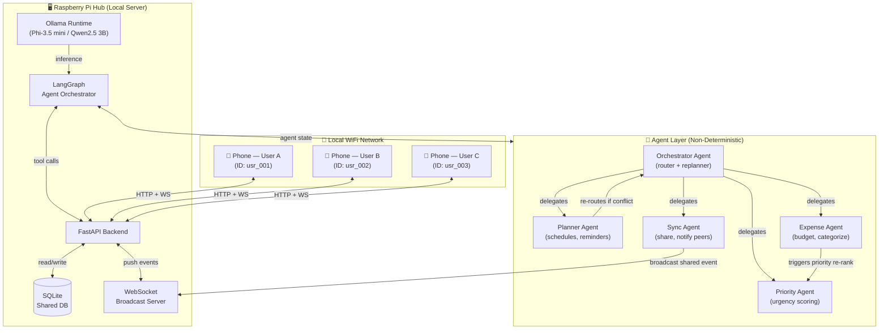
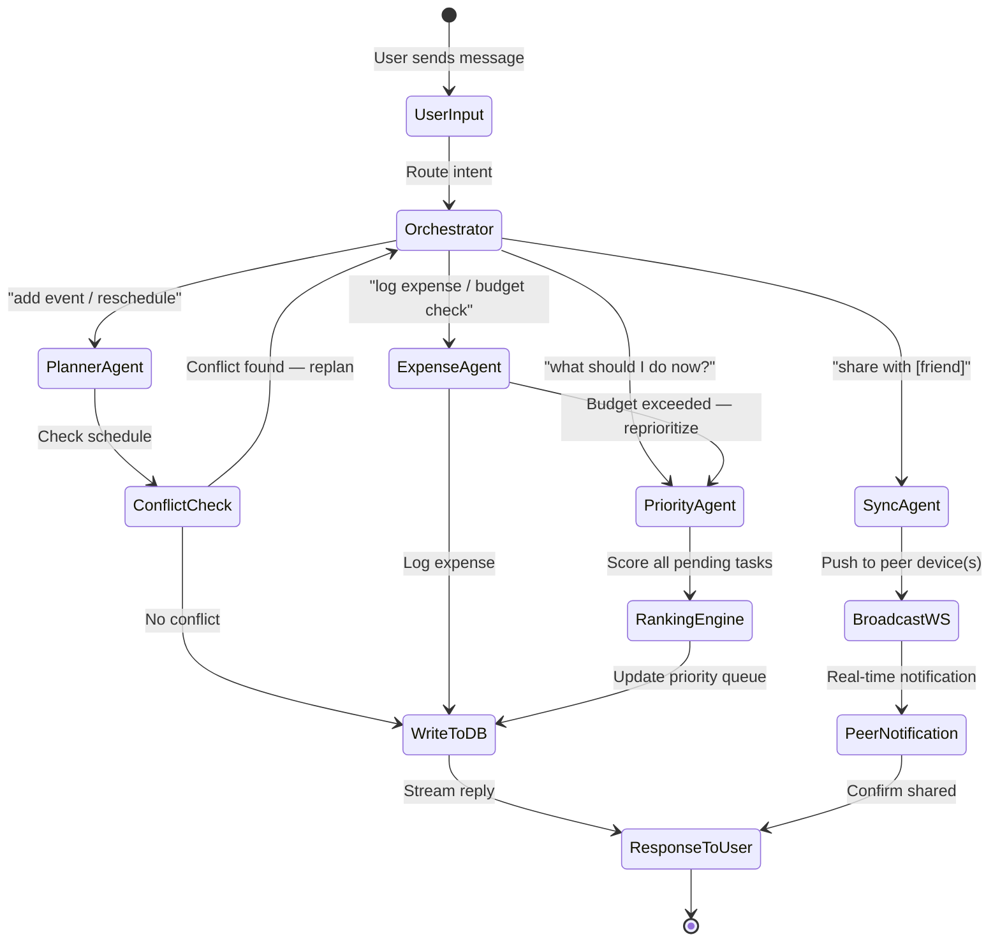
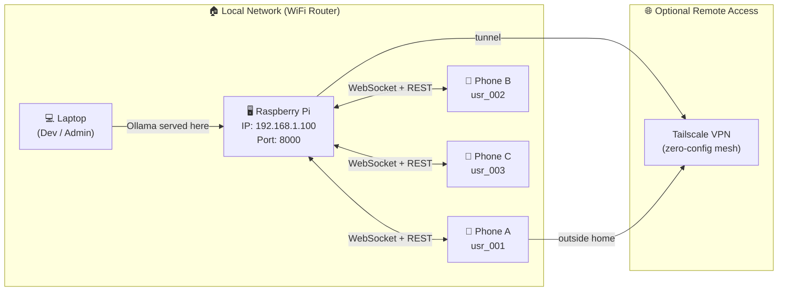

# Hive — Local AI Life OS for Friends
**Hacktoberfest 2026 | Theme: Build for a Friend**

> A personal AI assistant that runs entirely on a Raspberry Pi, shared across phones on a local network.
> No cloud. No subscriptions. Your data stays in your home.

---

## What It Does

**Hive** is a multi-user AI-powered life assistant that runs on a Raspberry Pi and serves everyone connected to the same WiFi. Each person gets a user ID and can:

- **Plan** — add events, get reminders, resolve scheduling conflicts
- **Track expenses** — log spending, categorize, get budget warnings
- **Prioritize** — ask "what should I focus on today?" and get a ranked answer
- **Share** — push a plan or event to a friend's device in real time

The AI brain is a local open-weight model (Phi-3.5 mini or Qwen2.5 3B) running via Ollama. The agent logic uses **LangGraph** for non-deterministic, stateful flows — agents can re-route, re-plan, and call each other based on what they discover mid-task.

---

## Why Open Source Matters Here

| Concern | Closed AI | Hive (Open) |
|---|---|---|
| Privacy | Your expenses hit a server | Everything stays on Pi |
| Cost | API bills per request | Free after hardware |
| Customization | Fixed behavior | Swap models, tune prompts |
| Internet required | Yes | No — works on home WiFi only |
| Multi-user shared state | Vendor lock-in | You own the DB |

---

## System Architecture



---

## Agentic Flow (Non-Deterministic LangGraph Loop)



---

## Network Topology



---

## Tech Stack

| Layer | Choice | Reason |
|---|---|---|
| LLM Runtime | **Ollama** | Easiest local model serving, Pi-compatible |
| Model | **Phi-3.5 mini (3.8B)** or **Qwen2.5 3B** | Fits Raspberry Pi 4 (4GB RAM) |
| Agent Framework | **LangGraph** | Stateful, cyclic, non-deterministic graphs |
| Backend | **FastAPI** | Async + native WebSocket support |
| Database | **SQLite** | Zero-config, lives on Pi |
| Frontend | **React + Vite** (PWA) | Installable on phones as a home screen app |
| Real-time sync | **WebSocket** via FastAPI | Push events to all connected users |
| Remote access | **Tailscale** | Works outside home, zero config, free tier |

---

## Project Structure (Planned)

```
hive/
├── server/
│   ├── main.py               # FastAPI app + WebSocket server
│   ├── agents/
│   │   ├── orchestrator.py   # LangGraph router
│   │   ├── planner.py        # Planner agent + tools
│   │   ├── expense.py        # Expense agent + tools
│   │   ├── priority.py       # Priority scoring agent
│   │   └── sync.py           # Peer broadcast agent
│   ├── tools/
│   │   ├── db_tools.py       # SQLite read/write tools
│   │   └── ws_tools.py       # WebSocket push tools
│   ├── models.py             # Pydantic schemas
│   └── database.py           # SQLite setup
├── client/
│   ├── src/
│   │   ├── App.jsx
│   │   ├── components/
│   │   │   ├── Chat.jsx      # AI chat interface
│   │   │   ├── Planner.jsx   # Calendar/event view
│   │   │   ├── Expenses.jsx  # Expense tracker view
│   │   │   └── Priority.jsx  # Today's priority list
│   │   └── hooks/
│   │       └── useWebSocket.js
│   └── vite.config.js
├── setup/
│   ├── install_pi.sh         # Ollama + deps setup on Pi
│   └── modelfile             # Custom Ollama system prompt
├── docker-compose.yml        # Optional: containerized deploy
└── README.md
```

---

## 2-Day Build Plan

### Day 1 — Core AI + Backend
- [ ] Set up Ollama on Raspberry Pi, pull Phi-3.5 mini or Qwen2.5 3B
- [ ] FastAPI server with `/chat`, `/events`, `/expenses` endpoints
- [ ] LangGraph orchestrator with Planner + Expense agents
- [ ] SQLite schema: users, events, expenses, priorities
- [ ] Basic React UI — chat + planner view

### Day 2 — Multi-User + Polish
- [ ] Priority agent (urgency scoring based on deadline + budget state)
- [ ] WebSocket broadcast — shared events push to all connected users
- [ ] User ID system — each phone gets a persistent ID
- [ ] Tailscale setup for remote demo
- [ ] PWA manifest so phones can install it
- [ ] Record demo video

---

## Scope of Improvement

### Tier 1 — Must Add (high impact, realistic in weekend)

#### 1. Streaming Responses
The model takes 5-10s on Pi. A blank screen kills UX. Stream tokens as they arrive.
- **How:** Ollama supports streaming. FastAPI `StreamingResponse` + `EventSource` on client.
- **Effort:** ~2 hours. Transforms feel from "broken" to "thinking".

#### 2. Per-User PIN Auth
Right now any device on the WiFi can see everyone's data.
- **How:** At first open, prompt for a 4-digit PIN. Store a bcrypt hash in SQLite. Pass a session token in WebSocket header.
- **Effort:** ~3 hours. Makes the multi-user story credible.

#### 3. Model Quantization — Be Specific
"Phi-3.5 mini or Qwen2.5 3B" is too vague. F16 models will OOM or crawl on Pi 4.
- **Use:** `qwen2.5:3b-instruct-q4_K_M` via Ollama — ~2GB RAM, ~4-6s/response on Pi 4
- **Fallback:** `qwen2.5:1.5b-instruct-q4_K_M` for Pi 3 or 2GB models — ~1.1GB, ~2-3s
- **Add to README:** Expected benchmark numbers so users set expectations correctly

#### 4. Proactive Morning Briefing
Agents are reactive only. A scheduled push is low effort and high demo value.
- **How:** APScheduler in FastAPI. At 8am, Planner + Expense agents generate a summary. Push to all connected clients via WebSocket.
- **Effort:** ~2 hours. "Good morning Priya, you have 2 meetings and you're ₹300 over on food this week."

#### 5. Voice Input (Whisper)
One wow moment for the demo — speak an expense or event instead of typing.
- **How:** `whisper.cpp` or `faster-whisper` on Pi. Record audio in browser, POST blob, get text back.
- **Effort:** ~3 hours including frontend mic button
- **Why it matters:** Makes the Pi feel like a home assistant, not a website

---

### Tier 2 — Nice to Have (add if ahead of schedule)

#### 6. Shared Expense Splitting
The real group-of-friends pain. "Split dinner ₹1200 three ways, Priya owes me ₹400."
- **How:** Expense agent gets a `split_expense` tool. Creates ledger entries per user. Running balance visible to all.
- **Effort:** ~4 hours
- **Demo moment:** Two phones showing who owes who in real time

#### 7. ICS Calendar Export
Let users pull their Hive events into Google Calendar or Apple Calendar.
- **How:** `/export/ics/{user_id}` endpoint, generate RFC 5545 format using `icalendar` library
- **Effort:** ~1 hour

#### 8. Data Backup / Export
SQLite on Pi with no backup is a single point of failure.
- **How:** `GET /export/json` and `GET /export/csv` endpoints. One-click download from UI.
- **Effort:** ~1 hour. Also good for demo ("your data, in a file you can read").

---

### Tier 3 — Post-Hackathon (too big for weekend, worth noting)

| Feature | Why It's Interesting | What It Needs |
|---|---|---|
| Receipt photo → expense | Snap a photo, AI reads total + items | LLaVA vision model (too big for Pi, needs laptop) |
| Long-term memory (ChromaDB) | Agent remembers patterns over weeks | Vector DB setup + embedding model |
| Fine-tuning on user data | Spending categories improve over time | LoRA training pipeline |
| Multi-Pi cluster | Friends across households | mDNS discovery + distributed SQLite |
| Offline PWA cache | Works when Pi reboots | Service Worker + IndexedDB |

---

### What to Tell Judges: The One Real Person

Don't say "roommate / family / friend group." Pick someone real:

> "I built this for my roommate [Name] who tracks every expense in a notes app but hates logging things manually. Now they just say 'spent 200 on groceries' and Hive logs it, recalculates their budget, and pushes an update to my phone so I know what's left in our shared fund."

Specificity wins. A named person + a concrete before/after is more compelling than a feature list.

---

### Revised Tech Stack (with improvements)

| Layer | Choice | Change from original |
|---|---|---|
| LLM Runtime | Ollama | Same |
| Model | **qwen2.5:3b-instruct-q4_K_M** | Now specific, quantized |
| Agent Framework | LangGraph | Same |
| Backend | FastAPI + APScheduler | Added scheduler for briefings |
| Streaming | FastAPI StreamingResponse + SSE | New — critical for UX |
| Auth | bcrypt PIN + JWT session token | New |
| STT | faster-whisper (local) | New — voice input |
| Database | SQLite + JSON/CSV export | Added export |
| Frontend | React + Vite PWA | Same |
| Real-time | WebSocket | Same |
| Remote access | Tailscale | Same |

---

## Idea Evaluation

### Strengths

- **Unique angle** — local multi-user AI hub is not something people are building at this scale for consumers
- **Strong open-source story** — LLM runs on Pi, zero cloud API dependency
- **Genuinely useful** — shared planning between roommates, family, or friends solves a real daily pain
- **Impressive live demo** — two phones syncing a shared event in real time via a Pi is visually compelling
- **Ticks every hackathon criterion** — open-weight model, local inference, agentic framework, real person use case

### Risks

| Risk | Severity | Mitigation |
|---|---|---|
| Pi is slow for 3B+ models (~5-10s/response) | Medium | Use Qwen2.5 1.5B, or run Ollama on laptop + Pi as reverse proxy |
| WebSocket sync adds complexity | Medium | Start with HTTP polling, upgrade to WS only if ahead of schedule |
| Weekend scope is wide (4 features + multi-user) | High | MVP = planner + expense on Day 1; sync + priority on Day 2 |
| Network demo at event venue | Low | Pre-record demo on home network, bring Pi as prop |

### Verdict

**Build it.** The Raspberry Pi as a shared AI hub is the hook that makes this stand out. Even if you only ship planner + expense + one shared event by demo time, the story — "your AI runs in your living room and your friends connect to it" — is immediately understandable and impressive.

---

## Hackathon Post Outline

> "I built a shared AI life assistant for my [roommate / family / friend group] that runs entirely on a Raspberry Pi sitting on our kitchen counter. No cloud, no subscription — just open-weight AI that knows our schedules, our budgets, and what we need to do today. We connect our phones to it over WiFi and it syncs our plans in real time. The open-source stack was the only way this was possible: Ollama made it trivial to run a 3B model locally, LangGraph let me build agents that actually think before they respond, and everything stays in a SQLite file that we own."

---

*Generated as part of Hacktoberfest 2026 — Build for a Friend*
